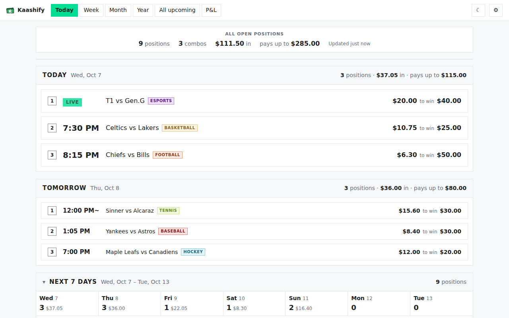
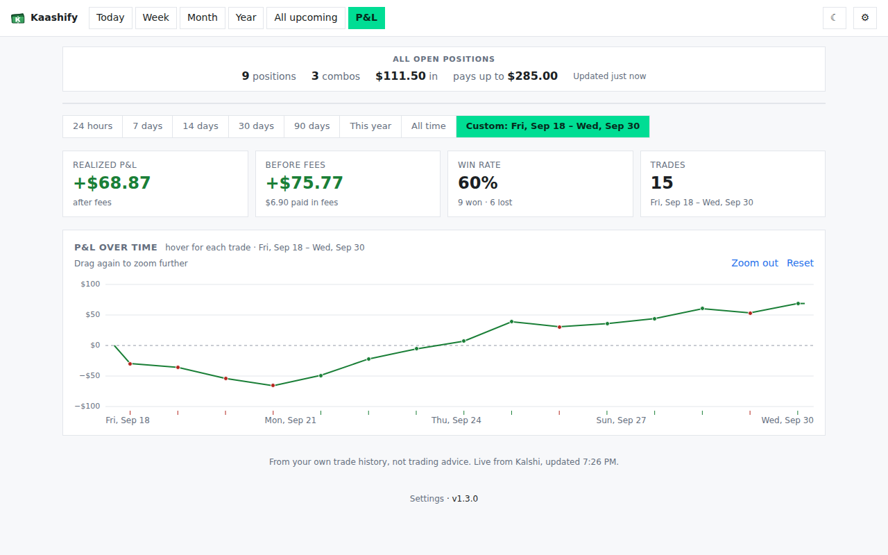
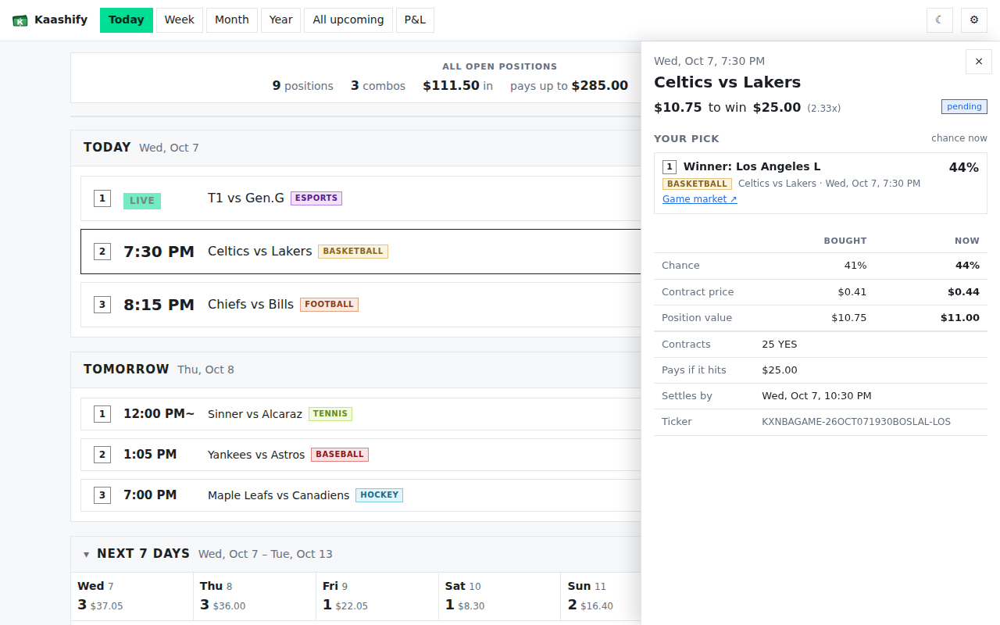
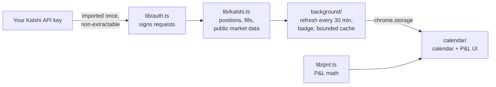

<div align="center">


# Kaashify

**Your Kalshi positions on a calendar, plus your realized P&L. A browser extension that runs entirely in your browser.**

[](https://github.com/junho0707/kaashify/actions/workflows/ci.yml)
[](https://github.com/junho0707/kaashify/releases/latest)
[](LICENSE)


<picture>
  <source media="(prefers-color-scheme: dark)" srcset="docs/screenshots/today-dark.png">
  
</picture>

</div>

## What it does

- **Calendar of open positions.** Combos and single bets are placed at each leg's game time, with views for today, week, month, year and all upcoming. Each one shows **time · event · money**.
- **Details on click.** Every leg, its odds when you bought vs. now, and what the position is worth.
- **LIVE badges** from Kalshi's game status, plus sport tags on every position.
- **P&L tab.** Realized P&L, fees and win rate, with a chart of every trade. Filter by **last 24 hours, 7, 14, 30 or 90 days, this year or all time**, and drag across the chart to zoom in.
- **Toolbar badge** counting legs that play today, plus light and dark themes.
- **Read-only and private.** It uses Kalshi's official API with *your own* API key, which never leaves your browser. There's no server.

<table>
<tr>
<td><picture><source media="(prefers-color-scheme: dark)" srcset="docs/screenshots/pnl-zoom-dark.png"></picture></td>
<td><picture><source media="(prefers-color-scheme: dark)" srcset="docs/screenshots/details-dark.png"></picture></td>
</tr>
<tr>
<td align="center"><sub>P&L with time filter and zoom</sub></td>
<td align="center"><sub>Leg-by-leg details</sub></td>
</tr>
</table>

## Install

Works on **Chrome, Edge, Brave, Opera** and **Firefox 129+**.

1. Download `kaashify-chromium-*.zip` (or `kaashify-firefox-*.zip`) from the [latest release](https://github.com/junho0707/kaashify/releases/latest) and unzip it.
2. **Chrome / Edge / Brave / Opera:** open `chrome://extensions` (or `edge://extensions`), turn on **Developer mode**, click **Load unpacked** and pick the unzipped folder.
   **Firefox:** open `about:debugging#/runtime/this-firefox`, click **Load Temporary Add-on** and pick the zip.
3. Click the Kaashify icon in the toolbar. A three-step setup page walks you through connecting your Kalshi API key
   (kalshi.com → Account & security → API Keys → **Create New API Key**).

Store listings are coming soon.

## How it works



- **Auth.** Your private key is imported with WebCrypto as a **non-extractable** `CryptoKey` and kept in IndexedDB.
  Each request is signed (RSA-PSS or Ed25519) as Kalshi's API requires. Only `GET` requests are made, so Kaashify
  can't trade or move money.
- **Schedule.** Start times come from the event ticker (`KXMLBTOTAL-26OCT071800LADATL` = Oct 7, 6:00 PM ET). When a
  ticker has only a date, the leg is shown at Kalshi's expected result time, marked `~`. Each pick is labeled with
  its market type from the series ticker ("First 5 innings total: Over 6.5 runs").
- **P&L.** Computed from your fills. Buying YES and NO of the same market nets $1 per pair, and partial (scalar)
  settlements are handled. It's the same basis as Kalshi's realized P&L. After the first load, only new fills are fetched.
- **Lean by design.** No runtime dependencies. Event names, start times and settled results are cached in a
  size-bounded cache (least-recently-used entries expire). Calendar entries are computed once per refresh and shared
  by every view, and big trade histories skip per-trade chart markers.

Privacy details are in [PRIVACY.md](PRIVACY.md).

## Development

Requires Node 22.18+.

```sh
npm install          # dev tools only: TypeScript, esbuild, jsdom, Playwright
npm run dev          # build to dist/chromium and rebuild on every change
npm run typecheck    # strict TypeScript
npm test             # unit + jsdom render tests (node:test, runs the .ts files directly)
npm run e2e          # Playwright: the built extension in Chromium against a mocked Kalshi API (checks real signatures)
npm run build        # dist/{chromium,firefox}/ + store zips
```

Load `dist/chromium` with **Load unpacked**, and click **Reload** on the extensions page after a rebuild.

```
src/
  lib/          no DOM, no chrome.* — pure logic, unit-tested
    auth.ts       API key import (PKCS#1 / PKCS#8 / Ed25519) and request signing
    kalshi.ts     Kalshi API client; builds the schedule; incremental fill history
    markets.ts    what a ticker says: start time, sport, market type
    pnl.ts        fills → trades → summary and chart series
    cache.ts      bounded, persistable cache
    types.ts      shared data shapes and the page ↔ background messages
  background/   service worker: refresh, badge, alarm, toolbar overlay, messages
  calendar/     the page: views, details drawer, P&L tab and chart, setup, settings
extension/      manifest.json, calendar.html, icons (copied into the build)
tests/          node:test unit tests and jsdom render tests
e2e/            Playwright tests
scripts/        build (esbuild + zips), icons, screenshots
```

## Contributing

Issues and pull requests are welcome. See [CONTRIBUTING.md](CONTRIBUTING.md).

## Disclaimer

Kaashify is an independent project. It is not affiliated with or endorsed by Kalshi, and it is not trading advice.
It uses Kalshi's public API with each user's own key.

[MIT License](LICENSE)
